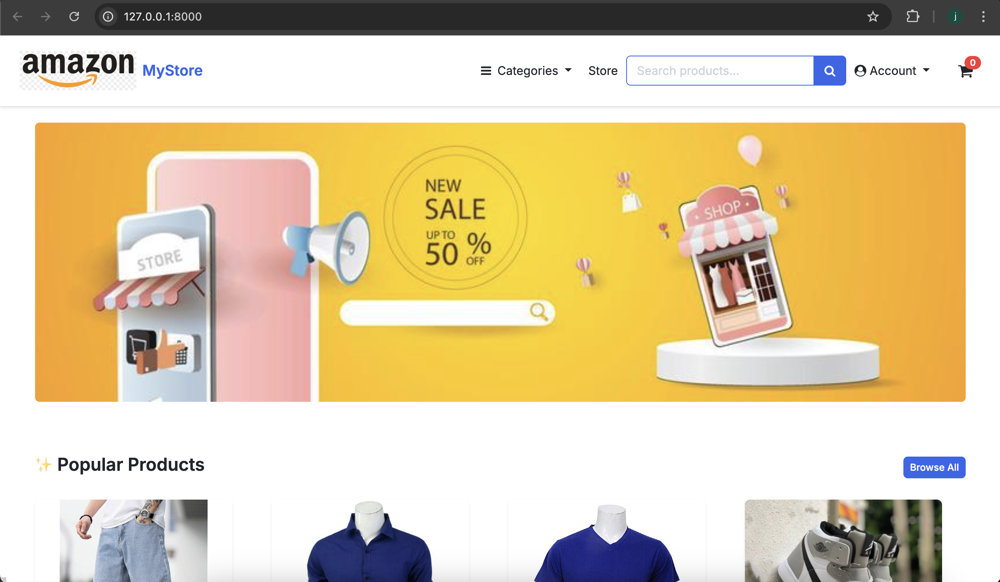
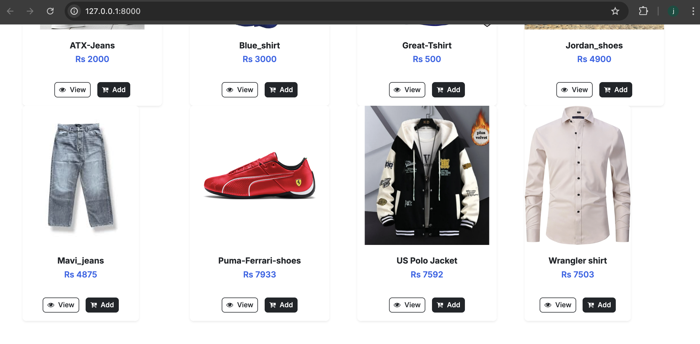
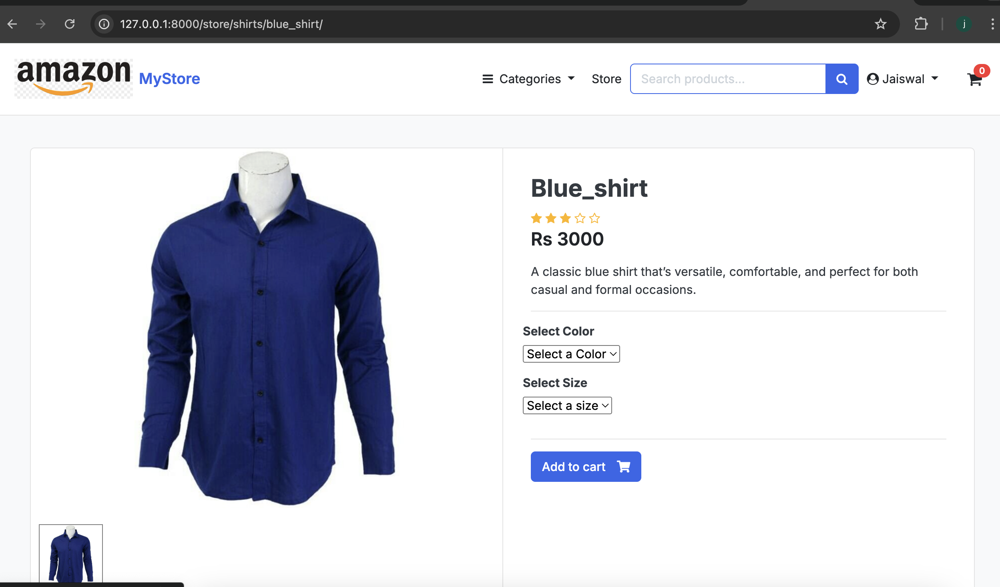
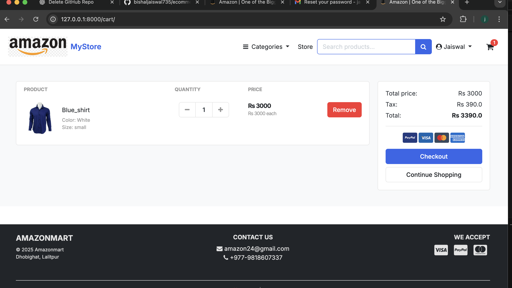
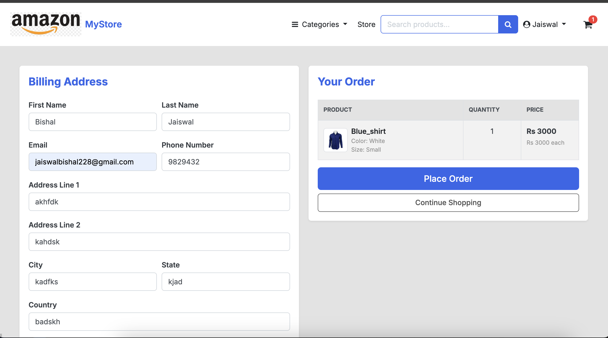
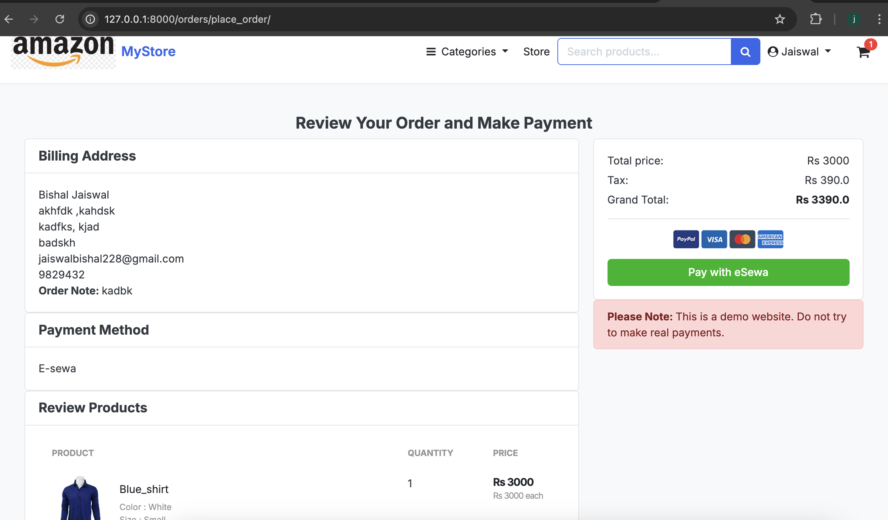
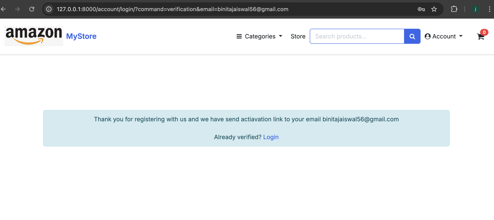

# 🛒 Django Ecommerce

A **full-featured Ecommerce web application built with Django**, using HTML templates. This project includes **email verification**, **password reset**, and **eSewa payment integration**.

---

## 🚀 Features

### 👤 User Authentication
- User Registration with **Email Verification**
- Secure Login & Logout
- **Forgot Password** with Email Verification
- Password Reset via Email Link

### 🛍️ Ecommerce
- Product listing by categories
- Product detail page
- Add to Cart & Remove from Cart
- Order placement & history

### 💳 Payment
- **eSewa Payment Gateway Integration**
- Secure payment verification
- Order confirmation after payment

### 🧑‍💼 Admin Panel
- Manage Users
- Manage Products & Categories
- View Orders & Payments

### 📧 Email Services
- Account verification emails
- Password reset emails
- Order confirmation emails

---

## 🛠️ Tech Stack

- **Backend:** Django  
- **Frontend:** HTML, CSS, Tailwind css 
- **Database:** SQLite (default)  
- **Payment Gateway:** eSewa  
- **Email Service:** SMTP (Gmail / Custom SMTP)  

---

## 📸 Screenshots

### 1️⃣ Home Page

### 2️⃣ Product Listing

### 3️⃣ Product Detail

### 4️⃣ Cart Page

### 5️⃣ Checkout & Payment

### 6️⃣ Email Verification

